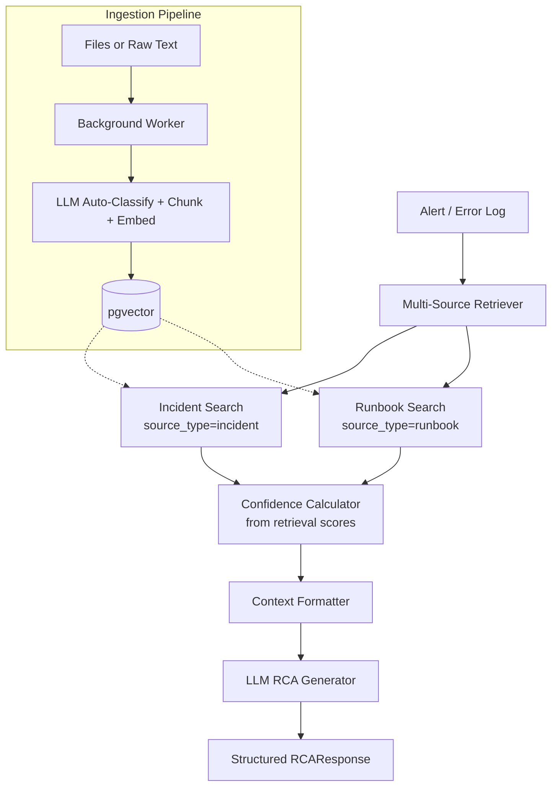

# AI Developer Assistant

RAG-powered incident intelligence for DevOps teams.

## What It Does

- **Ingest** past incident reports and runbooks via file upload or raw text paste
- **Auto-classify** unstructured text and extract metadata (title, service, severity, tags) using LLM
- **Retrieve** similar past incidents and relevant runbooks from a new alert or error log
- **Generate structured RCA** with probable root cause, similar incidents, suggested actions, and runbook references
- **Confidence scoring** based on retrieval similarity scores (computed from vector search, not LLM guesswork)

## Architecture



## Tech Stack

| Layer | Technology |
|-------|-----------|
| Framework | FastAPI + Uvicorn |
| Vector DB | PostgreSQL + pgvector |
| LLM / Embeddings | Ollama (`gemma3:4b`, `nomic-embed-text`) or Google Gemini |
| Orchestration | LangChain (LCEL chains, PGVector, document loaders) |
| Background Jobs | FastAPI BackgroundTasks |
| Deployment | Docker Compose |

## Quick Start

### Prerequisites

- Docker + Docker Compose
- Ollama running locally with models pulled:

```bash
ollama pull nomic-embed-text
ollama pull gemma3:4b
```

### Setup

```bash
git clone https://github.com/yyogesh0301/ai-rag-system.git
cd ai-rag-system
cp .env.example .env   # fill in your values
```

### Run

```bash
docker compose up --build
```

API available at `http://localhost:8000` | Swagger UI at `http://localhost:8000/docs`

### Seed the Corpus

```bash
./scripts/seed.sh
```

Ingests all 16 incident reports and 3 runbooks from `data/`.

## API Endpoints

| Method | Endpoint | Description |
|--------|----------|-------------|
| `POST` | `/ingest/file` | Upload a file (PDF, CSV, JSON, TXT, MD) for ingestion |
| `POST` | `/ingest/text` | Paste raw text for LLM-classified ingestion |
| `POST` | `/diagnose/` | Submit an alert/error log, get structured RCA |
| `POST` | `/query` | General RAG Q&A over all ingested documents |
| `GET` | `/status/{job_id}` | Check ingestion job status |
| `GET` | `/health` | Health check |

### Ingest a File

```bash
curl -X POST http://localhost:8000/ingest/file \
  -F "file=@data/incidents/INC-001.md"
```

Markdown files with YAML frontmatter are parsed automatically. Files without frontmatter (`.txt`, `.md` without `---`) are sent to the LLM for auto-classification and metadata extraction.

### Ingest Raw Text

```bash
curl -X POST http://localhost:8000/ingest/text \
  -F "content=Kafka consumer lag spiking to 500k on meter.readings.raw topic. Consumer group mdms-meter-events showing 12 partitions with zero consumers assigned."
```

The LLM classifies the text as incident or runbook and extracts title, service, severity, and tags.

### Diagnose an Alert

```bash
curl -X POST http://localhost:8000/diagnose/ \
  -H "Content-Type: application/json" \
  -d '{"input_text": "Kafka consumer lag spiking on mdms-meter-events consumer group, lag over 400k messages", "top_k": 3}'
```

Returns:
```json
{
  "probable_root_cause": "...",
  "confidence_level": "high",
  "similar_incidents": [{"incident_id": "INC-001", "title": "...", "similarity": "..."}],
  "suggested_actions": [{"action": "...", "source": "RB-001:Diagnosis Decision Tree"}],
  "runbook_refs": ["RB-001"],
  "summary": "..."
}
```

### General Q&A

```bash
curl -X POST http://localhost:8000/query \
  -H "Content-Type: application/json" \
  -d '{"question": "What caused the payment service OOM incidents?"}'
```

## Ingestion Pipeline

The ingestion pipeline handles content-hash deduplication automatically:

- **Same file, same content** — skipped (no re-embedding)
- **Same file, different content** — old chunks deleted, new ones ingested
- **New file** — ingested normally

Supported formats: `.pdf`, `.csv`, `.json`, `.txt`, `.md`

For `.md` files:
1. If YAML frontmatter exists — metadata extracted from frontmatter, body split by `##` headings
2. If no frontmatter — LLM auto-classifies as incident/runbook and extracts metadata

## Synthetic Test Corpus

The `data/` directory contains a purpose-built incident corpus for testing retrieval quality:

| Group | Files | Purpose |
|-------|-------|---------|
| Near-Duplicates | INC-001/002, INC-003/004 | Same symptom, different root cause |
| Red Herrings | INC-005, INC-006 | Same keywords, unrelated context |
| Cascading Failures | INC-007, INC-008 | Cross-referenced related incidents |
| Diverse Scenarios | INC-009 to INC-016 | TLS, S3, Redis, DLQ, NTP, disk, rate limiting, migrations |
| Runbooks | RB-001 to RB-003 | Kafka lag, DB connection pool, pod CrashLoopBackOff |

## Configuration

| Variable | Description | Default |
|----------|-------------|---------|
| `LLM_PROVIDER` | `ollama` or `gemini` | `ollama` |
| `OLLAMA_HOST` | Ollama server URL | `http://localhost:11434` |
| `OLLAMA_EMBED_MODEL` | Embedding model | `nomic-embed-text` |
| `OLLAMA_GENERATE_MODEL` | Generation model | `gemma3:4b` |
| `GEMINI_API_KEY` | Gemini API key | — |
| `DATABASE_URL` | PostgreSQL connection string | — |

Switch providers with no code changes:

```env
LLM_PROVIDER=ollama    # local, no API key
LLM_PROVIDER=gemini    # cloud, needs GEMINI_API_KEY
```

## Project Structure

```
ai-rag-system/
├── api/
│   ├── routes/
│   │   ├── ingest.py       # POST /ingest/file, POST /ingest/text
│   │   ├── diagnose.py     # POST /diagnose/
│   │   ├── query.py        # POST /query
│   │   └── status.py       # GET /status/{job_id}
│   ├── models/
│   │   └── incident.py     # RCAResponse, DiagnoseRequest, IngestJobResult
│   ├── app.py              # FastAPI app + lifespan
│   ├── jobs.py             # Job state tracking
│   └── schemas.py          # Query/Ingest Pydantic models
├── rag/
│   ├── providers/          # LLM provider abstraction (Ollama / Gemini)
│   ├── ingest.py           # Document loading, frontmatter parsing, heading splitter
│   ├── chunk.py            # Text splitting with metadata passthrough
│   ├── db.py               # pgvector setup, content-hash dedupe, HNSW indexing
│   ├── embed.py            # Embedding + storage
│   ├── retrieve.py         # Multi-source retrieval, confidence scoring
│   ├── chat.py             # RCA generation, metadata extraction, Q&A chains
│   ├── service.py          # Query orchestration
│   └── observability.py    # Structured logging
├── data/
│   ├── incidents/          # 16 synthetic incident reports
│   └── runbooks/           # 3 operational runbooks
├── scripts/
│   └── seed.sh             # Bulk ingest script
├── server.py               # Uvicorn entry point
├── docker-compose.yml
├── Dockerfile
└── requirements.txt
```
